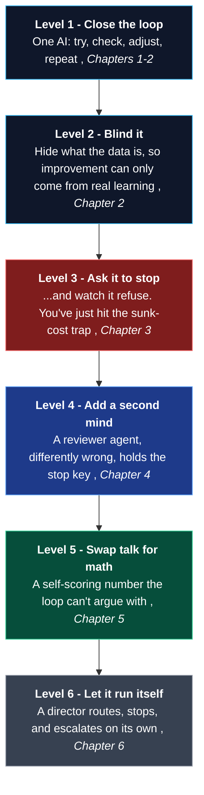

<div align="center">

# Autopilot: Zero to Hero

### Build autonomous AI agent loops from zero and confront the reason they can't satisfy themselves.

[](book/00-start-here.md)

[](https://zenodo.org/records/19551173)
[](https://zenodo.org/records/19846960)
[](https://zenodo.org/records/20364204)
[](https://www.neuralchemy.in/)

</div>

---

> **Tell a person to draw an apple and stop when they're satisfied. They draw it a few times, feel happy, and stop.**
> **Tell an AI the exact same thing. It never stops.**

That one gap is the whole story here. Autonomous AI, agents that run themselves, is everywhere right now. But the moment you actually build a loop where an AI generates its own work, grades it, and improves, you hit a wall nobody warns you about: the AI doesn't know when it's done. It found a 99% answer and still burned dozens of tries chasing a last fraction it could never reach, until it was switched off from outside.

This repository is two things at once:

1. **A beginner-first field guide** that teaches you, from zero, no PhD required, what an autonomous AI loop is, how to build one, and how to fix the "it never stops" problem. **[Start reading](book/00-start-here.md)**
2. **The real research** behind it: three published papers, with all the code and data you can run yourself.

## What you'll be able to do after reading this

By the time you finish the guide, you will be able to:

- **Explain, in plain language, what an autonomous AI loop is**, and why "autonomous" is harder than it sounds.
- **Build one yourself, from scratch**, and prove it's genuinely learning, not cheating.
- **Recognize why autonomous agents break**, the sunk-cost trap, and catch it in your own agents.
- **Apply two real, proven fixes**: a reviewer agent, and self-scoring math.
- **Read the research and run the code** behind every claim.

You don't need to know any of this yet. That's the whole point, you'll build it up one level at a time.

## The one idea

> Autonomy is not the default state of an AI in a loop. Left alone, an AI cannot decide it's "done." Knowing when to stop is the hardest part of making it autonomous, and this is the story of engineering that stop.

## How you build an autonomous loop, level by level

You don't build a self-running AI in one leap. You add one capability at a time, and each level only makes sense once you've felt the problem in the level before it. This is the exact ladder the guide walks you up:



Levels 1 and 2 get a loop working. Level 3 is where it breaks, the discovery at the heart of this research. Levels 4 through 6 are three escalating ways to fix it. Follow the chapters below and you climb this ladder one rung at a time.

## The Field Guide

Read it like a short book, top to bottom, each chapter builds on the last. Every hard idea starts with a plain-life analogy, then the machine, then the real numbers from the experiments.

| # | Chapter | What you'll learn |
|---|---------|-------------------|
| 0 | [Start Here](book/00-start-here.md) | The apple story and the big idea (5-minute read) |
| 1 | [What Is a Loop?](book/01-what-is-a-loop.md) | What "AI in the loop" means, from zero |
| 2 | [Build Your First Loop](book/02-build-your-first-loop.md) | The four moving parts, hands-on, you can run it |
| 3 | [The Stopping Problem](book/03-the-stopping-problem.md) | Why an AI alone can't satisfy itself, with real failures |
| 4 | [Fixing It With Teams](book/04-fixing-it-with-teams.md) | Why a committee of specialists beats one genius |
| 5 | [Fixing It With Math](book/05-fixing-it-with-math.md) | Proof beats talk: a number that decides |
| 6 | [What's Next](book/06-whats-next.md) | The open frontier, and an experiment you could run |
| - | [Glossary](book/glossary.md) | Every term, in plain language |

**Who it's for:** anyone curious about autonomous AI who can read a little Python. **What you'll leave with:** a real mental model of how self-running AI loops work, why they fail, and proven ways to fix them, plus runnable code for each.

---

## The Research Underneath

The field guide is the friendly front door. These are the rigorous, citable papers it's built on, from Sanskar Jajoo, Neuralchemy Labs:

- **Paper 1, AITL Taxonomy** ([Zenodo](https://zenodo.org/records/19551173)): the vocabulary and the first proof of concept. Code: [`experiments/aitl_blind_nas/`](experiments/aitl_blind_nas/)
- **Paper 2, The Autonomous Sunk-Cost Fallacy** ([Zenodo](https://zenodo.org/records/19846960)): the stopping problem, measured across 13 models. Code: [`aeos_sunk_cost/`](aeos_sunk_cost/)
- **Paper 3, The Modality Paradox** ([Zenodo](https://zenodo.org/records/20364204)): both fixes, the team-based fix and its surprising twist, and the math-based Cognitive Yield self-scoring stop. Code: [`experiments/modality_paradox/`](experiments/modality_paradox/)

On the math-based fix: the self-scoring number this guide calls Omega is published in Paper 3 under the name Cognitive Yield. It's being built into a full self-running meta-orchestrator in the sibling `aeos-lab` project, that's the live frontier covered in Chapter 6, not a separate paper.

For the formal, academic definitions, see [`docs/`](docs/). For citations, see [`CITATION.cff`](CITATION.cff).

## Repository map

```text
Autopilot-Zero-to-Hero/
|
|-- book/                          THE FIELD GUIDE (start here)
|   |-- 00-start-here.md               the apple story and the map
|   |-- 01-what-is-a-loop.md           HITL vs AITL, from zero
|   |-- 02-build-your-first-loop.md    hands-on, runnable
|   |-- 03-the-stopping-problem.md     the core discovery
|   |-- 04-fixing-it-with-teams.md     the reviewer + coder fix
|   |-- 05-fixing-it-with-math.md      the self-scoring fix
|   |-- 06-whats-next.md               the open frontier
|   `-- glossary.md
|
|-- docs/                          FORMAL DEFINITIONS (the rigorous version of the book)
|   |-- AITL-DEFINITION.md
|   |-- AITL-VS-HITL.md
|   `-- DESIGN-PRINCIPLES.md
|
|-- paper/                         THE SCIENTIFIC MANUSCRIPTS
|   |-- paper1_taxonomy/               Paper 1 source, PDF, figures
|   |-- paper2_sunk_cost/              Paper 2 source, PDF, figures
|   `-- paper3_modality_paradox/       Paper 3 source, PDF, figures
|
|-- experiments/                   RUNNABLE LOOP CODE
|   |-- aitl_blind_nas/                Chapter 2: your first loop (agent, trainer, runner)
|   `-- modality_paradox/              Chapter 4: team-loop experiment design and results
|
|-- aeos_sunk_cost/                RUNNABLE LOOP CODE
|   |-- runner.py                      the single-agent baseline (Chapter 3)
|   |-- runner_critic.py               the two-agent reviewer/coder loop (Chapter 4)
|   |-- runner_boundless.py            the extended-horizon sunk-cost study
|   `-- questionbook.md                every research question behind the experiments
|
|-- CITATION.cff                   how to cite this work
`-- LICENSE
```

*(An `archive/` folder with legacy drafts is kept locally only, it's excluded from GitHub via `.gitignore`.)*

## Run it yourself

Every loop in the book is real code. Copy `.env.example` to `.env` in a code folder and add your LLM API keys, or point it at a free local model, see the file headers.

```bash
# Chapter 2, your first blind autonomous loop
cd experiments/aitl_blind_nas && python runner.py

# Chapter 3, the single-agent sunk-cost loops
cd aeos_sunk_cost && python runner.py

# Chapter 4, the two-agent (reviewer + coder) team loop
cd aeos_sunk_cost && python runner_critic.py
```

> **Where things live:** GitHub hosts the runnable code, data, and this guide. Zenodo hosts the permanent, citable preprint PDFs. Use the Zenodo records in [`CITATION.cff`](CITATION.cff) for formal citations.

---

<div align="center">

*Neuralchemy Labs Research Series, [neuralchemy.in](https://www.neuralchemy.in/)*

**New here? [Start with the apple story](book/00-start-here.md)**

</div>
