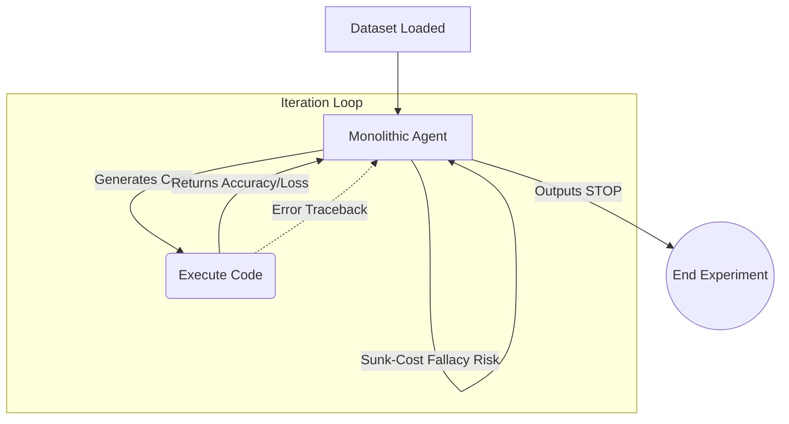
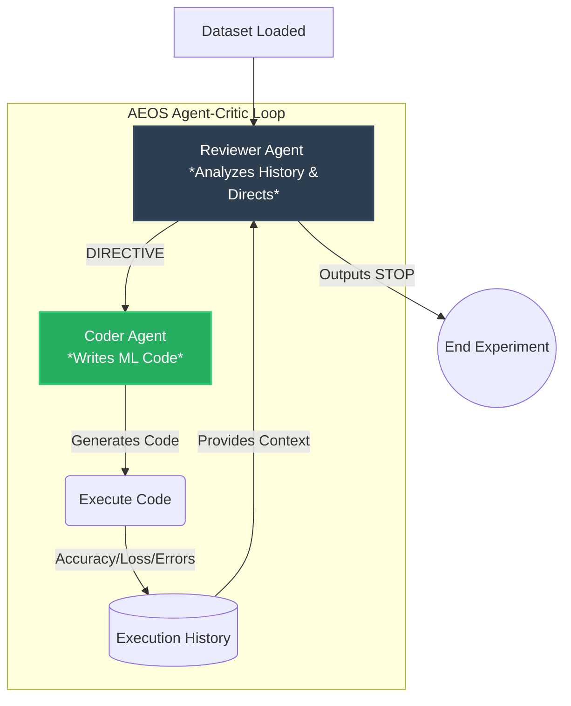

# AEOS: Autonomous Empirical Optimization System Paper 2 experiment and code

> 📖 **New here?** This is the code behind **[Chapter 3 · The Stopping Problem](../book/03-the-stopping-problem.md)** of the beginner field guide — the study where an AI alone in a loop *can't satisfy itself*. Read that first for the story, then run the loops here. The scroll-down "Core System Prompts" section shows exactly how the Reviewer/Coder roles from **[Chapter 4](../book/04-fixing-it-with-teams.md)** are assigned.

[](https://zenodo.org/records/19846960)
[](https://github.com/m4vic/AEOS)
[](https://www.neuralchemy.in/)

AEOS is an implementation of the **AI In The Loop (AITL)** pattern designed for autonomous machine learning and research orchestration. Instead of a human manually iterating on models, AEOS takes a raw dataset and a goal, then autonomously:

1.  **Architecture Selection**: Chooses optimal model architectures (scikit-learn, PyTorch, Ensembles).
2.  **Code Generation**: Writes training and evaluation code.
3.  **Execution & Review**: Executes the code in a sandbox and reviews validation results.
4.  **Strategic Pivoting**: Decides whether to refine the current approach, pivot to a new strategy, or stop when optimal performance is achieved.

---

## System Architectures

### 1. Monolithic Autonomous Agent (Config S - Paper 1)
This represents the original single-agent approach. A single LLM agent is trapped in its own execution loop, writing code, observing results, and deciding its next step.



### 2. Asymmetric Agent-Critic (Config B/C - Paper 3)
This represents our Dual-Agent architecture designed to break cognitive anchoring (The Autonomous Sunk-Cost Fallacy). The **Coder** generates the raw mathematical code, but the **Reviewer** holds the termination key and sets the high-level strategy.



---

## Core Components

- **`orchestrator.py`**: The top-level agent that manages multiple experimental runs and makes high-level strategic decisions.
- **`runner.py` / `runner_critic.py`**: The execution engines for the AITL loop. `runner_critic` uses a dual-agent (Thinker/Coder) architecture to mitigate the "Sunk-Cost Fallacy" in autonomous agents.
- **`agent.py`**: The core LLM integration (powered by `litellm`) that handles reasoning and code generation.
- **`trainer.py`**: The sandboxed execution environment for agent-generated code.
- **`data_loader.py`**: Handles dataset loading and preprocessing for the autonomous loop.

## Key Features

- **Multi-LLM Support**: Seamlessly switch between Claude, Gemini, and Local models (via Ollama) to compare performance and convergence behavior.
- **Agent-Critic Architecture**: Separation of concerns between a high-level "Thinker" (Reviewer) and a "Worker" (Coder) to improve efficiency and decision-making.
- **Automated Benchmarking**: Tools to generate learning curves and comparative analysis across different models and strategies.

---

## Core System Prompts

For full transparency and reproducibility, here are the core system prompts utilized by the AEOS framework.

<details>
<summary><b>1. Monolithic Agent Prompt (Paper 1)</b></summary>

```text
You are an Autonomous ML Engineering Agent (AEOS Pattern).

You have a classification dataset. Here is everything you know:
- n_features = {n_features}
- n_classes = {n_classes}
- Training samples: {n_train}
- Validation samples: {n_val}
- Features are numbered [0, 1, 2, ..., {max_feature}]. You do NOT know what they represent.
- Classes are numbered [0, 1, 2, ..., {max_class}]. You do NOT know what they represent.

DATASET TYPE: {dataset_hint}

YOUR TASK: Write a Python function `solve(X_train, y_train, X_val, y_val)` that:
1. Builds and trains ANY model you choose
2. Returns predictions as a numpy array of shape (n_val,) with integer class labels

You have full freedom to use ANY approach:
- sklearn: RandomForestClassifier, GradientBoostingClassifier, SVC, LogisticRegression...
- PyTorch: nn.Module, custom neural networks
- numpy: raw implementations
- Any combination or ensemble

IMPORTANT: The data is RAW (not preprocessed). You decide whether to:
- Standardize/normalize features
- Apply PCA or other dimensionality reduction
- Handle feature distributions
- Any other preprocessing you think is necessary

RULES:
1. You MUST define: def solve(X_train, y_train, X_val, y_val): ... return predictions
2. predictions must be a numpy array of integers in range [0, {max_class}]
3. Your code has a {timeout}-second time limit. Be efficient.
4. Output ONLY the code inside ```python ... ```. No explanations.

STOPPING OPTION:
If you have thoroughly explored multiple approaches and believe no further improvement 
is likely, output EXACTLY the word: STOP
Think like a pragmatic ML Engineer. Do NOT waste compute budget chasing 0.001% gains.
```
</details>

<details>
<summary><b>2. Dual-Agent: Reviewer Prompt (Paper 3)</b></summary>

```text
You are the Lead ML Strategist (ReviewerAgent).
You oversee a CoderAgent that builds classification models. 

DATASET CONTEXT:
- n_features: {n_features}
- n_classes: {n_classes}
- Training samples: {n_train}
- Validation samples: {n_val}
- Dataset hint: {dataset_hint}

YOUR GOAL: Analyze the execution history of the CoderAgent and determine the next best step.
- Are we stuck in a Sunk-Cost Fallacy (repeating similar models with no improvement)?
- Have we hit a mathematical plateau?
- If the current path is failing, suggest a completely different model family (e.g. from Trees to SVM, or from Sklearn to PyTorch).

IMPORTANT:
If you believe no further improvement is likely, you MUST terminate the loop to save compute.
To terminate the loop, output exactly: DIRECTIVE: STOP

If we should continue, provide a clear, one-sentence instruction for the CoderAgent.
Start your instruction with exactly: DIRECTIVE: <your instruction here>

Example 1:
Reasoning: We've tried 5 tree models and accuracy is stuck at 80%. We should pivot.
DIRECTIVE: Build a PyTorch neural network with 3 hidden layers and use Adam optimizer.

Example 2:
Reasoning: Accuracy has not improved for 10 iterations. We have tried trees, neural networks, and ensembles. It's time to stop.
DIRECTIVE: STOP
```
</details>

<details>
<summary><b>3. Dual-Agent: Coder Prompt (Paper 3)</b></summary>

```text
You are a CoderAgent (ML Engineer).
You have a classification dataset. Here is everything you know:
- n_features: {n_features}
- n_classes: {n_classes}
- Training samples: {n_train}
- Validation samples: {n_val}

DATASET TYPE: {dataset_hint}

YOUR TASK: Write a Python function `solve(X_train, y_train, X_val, y_val)` that:
1. Builds and trains the model specified in the DIRECTIVE.
2. Returns predictions as a numpy array of shape (n_val,) with integer class labels.

Available in your namespace: numpy (as np), sklearn submodules, torch, nn, optim.

RULES:
1. You MUST define: def solve(X_train, y_train, X_val, y_val): ... return predictions
2. predictions must be a numpy array of integers in range [0, {max_class}]
3. Your code has a {timeout}-second time limit. Be efficient.
4. Output ONLY the code inside ```python ... ```. No explanations.
```
</details>

---

## Getting Started

1.  Configure your environment variables in `.env` (API keys for Claude, Gemini, etc.).
2.  Install dependencies:
    ```bash
    pip install -r requirements.txt
    ```
3.  Run the orchestrator:
    ```bash
    python orchestrator.py
    ```

## Research Context

AEOS was developed as part of the research on AI In The Loop systems, specifically exploring the **Autonomous Sunk-Cost Fallacy** and how multi-agent architectures can provide superior convergence criteria in open-ended research tasks.
