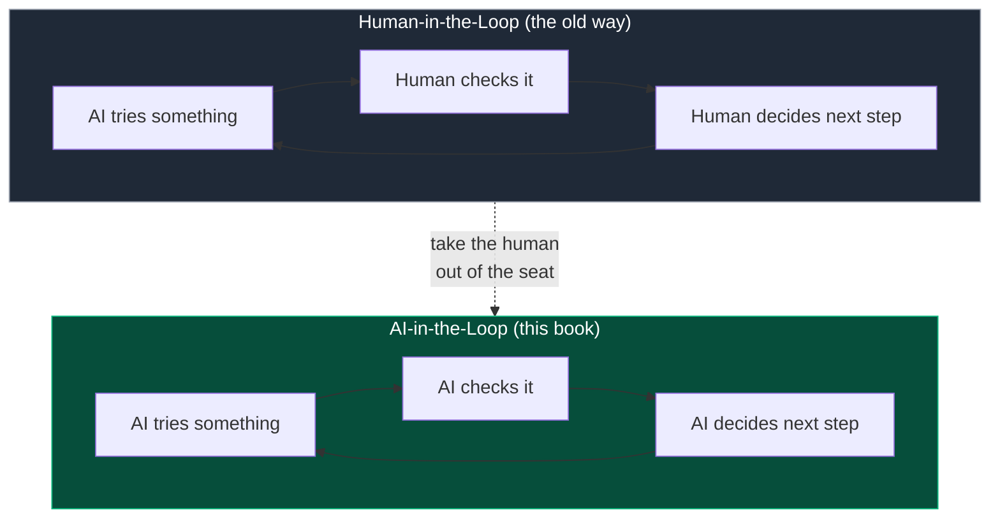
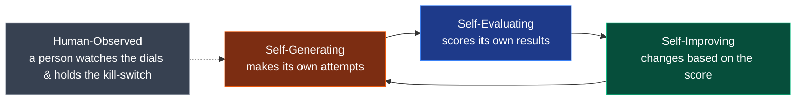

# Chapter 1 — What Is a Loop?

*From zero. No prior AI knowledge assumed. ~12 minutes.*

← [Back to Start](00-start-here.md) · [Next: Build Your First Loop →](02-build-your-first-loop.md)

---

## The everyday version

You've been in a feedback loop your whole life. Learning to cook is one:

1. **Try** — you make the dish.
2. **Taste** — you check how it came out.
3. **Adjust** — too bland? add salt. Then you cook it again.

Try → taste → adjust → try again. Round and round, each lap a little better, until it's good enough and you stop. That's a **loop**: a cycle where the result of one round *feeds into* the next.

Now, who's doing the tasting? For most of computing history, the answer to "who checks the result and decides what to do next" has been: **a human.**

## Human-in-the-Loop (HITL)

When a human sits inside that decision cycle, we call it **Human-in-the-Loop**, or **HITL**. It's everywhere:

- A photo app flags a post; **a human** decides if it breaks the rules.
- An AI drafts a medical note; **a doctor** checks it before it counts.
- A company builds a new AI model; **expert testers** spend months trying to break it before release.

HITL is safe and sensible. The human is the taste-tester, the quality gate, the one accountable for the final call. But it has a hard ceiling:

| Problem with HITL | Why it hurts |
|---|---|
| **It scales with people** | Twice the work needs twice the humans. |
| **It's slow** | Human review takes hours or days. |
| **It's expensive** | Expert reviewers can cost **$200–500 an hour**. |
| **It gets tired** | People drift, get bored, make inconsistent calls. |

Real example from the research: when OpenAI stress-tested GPT-4, it took **50+ outside experts working over 6 months.** And every time the model updates, you get to do that all over again. The human isn't the *solution* anymore — the human is the **bottleneck**.

## The flip: take the human out of the seat

Here's the move that starts everything. Look at that loop again:

> **Try → Check → Adjust → repeat**

What if an **AI** sat in the "check" and "adjust" seats too? Not a human tasting the soup — *another AI* tasting it, and deciding what to change next. The human steps out of the chair and watches from across the room.

That's **AI-in-the-Loop**, or **AITL**. It's the whole premise of this book, and it came from a genuinely simple thought:

> *"Human-in-the-Loop is everywhere. What if I remove the human from the loop and drop an AI into that slot instead?"*

The human doesn't vanish. They move **up and out** — from *operating* the loop every single round to *supervising* it: setting the goal, setting a budget, watching the dials, and keeping a hand near the off-switch.

## The four things that make a loop "AITL"

Not every AI that does a task is an AITL system. For a loop to truly run itself, the AI has to own **four jobs** that a human used to own. Think of them as four hats the AI now wears:

**1. Self-Generating** — *It makes its own attempts.*
The AI writes the test, the code, the idea itself. Nobody hands it each attempt.
*The HITL opposite:* a human writing out every single test case by hand.

**2. Self-Evaluating** — *It scores its own results.*
The AI judges how good each attempt was, using a number it can measure — accuracy, a loss value, a pass/fail. No human labels each one.
*The HITL opposite:* a human clicking "good" or "bad" on every output.

**3. Self-Improving** — *It uses the score to get better.*
The AI reads its own results and changes its next attempt because of them. That's the "loop" actually closing.
*The HITL opposite:* a human reading a report and manually pushing the fix.

**4. Human-Observed** — *A person watches, but doesn't drive.*
Humans set the goal and the limits (budget, time, a safety kill-switch) and monitor the big picture — but they don't touch each lap.
*The HITL opposite:* a human being a required checkpoint on every single round.

> **The key shift:** In HITL, the human works **once per round** (exhausting — it never ends). In AITL, the human works **once per experiment** (set it up, watch the summary). That's the difference between *driving the car* and *being the person who decided where to go.*

If you want the exact, formal definitions of these four, they live in [`docs/AITL-DEFINITION.md`](../docs/AITL-DEFINITION.md). This chapter is the plain-language version; that's the rigorous one.

## "Wait — hasn't this been done already?"

Yes and no, and the honest answer matters.

Loops where AI checks its own work aren't brand new. A few famous systems already do pieces of it:

- **AlphaZero** taught itself chess and Go by playing *itself* millions of times — generating its own games, judging who won, improving. No human game records needed.
- **Constitutional AI** had an AI critique another AI's answers against a set of written principles, cutting the need for human labels by about **90%**.
- **Karpathy's autoresearch** (2026) let an AI agent tweak its own training code, run experiments, and keep the improvements — about **700 experiments over two days**, finding tweaks human engineers had missed.

So what's left to figure out? Look closely and each of these has a **boundary**:

- AlphaZero only works in tidy, rule-bound games where "who won" is never in doubt.
- Constitutional AI runs during *training*, not as a live agent exploring on its own.
- autoresearch never decides it's *finished* — it runs until a human walks over and kills the terminal.

That last one is the thread this whole book pulls on. These impressive systems can generate, evaluate, and improve — but **almost none of them can decide, on their own, that they're done.** The "stop" still comes from outside.

> The contribution of this research isn't inventing the loop. It's naming the four properties clearly, and then zooming in hard on the one nobody had solved: **self-termination.** When does the AI, all by itself, put the pencil down?

## Where we're headed

You now have the vocabulary:

- A **loop** is try → check → adjust → repeat.
- **HITL** = a human sits in the loop. Safe, but a bottleneck.
- **AITL** = an AI sits in the loop. Scales beautifully, *if* you can trust it.
- An AITL system wears four hats: **generate, evaluate, improve, be-observed.**
- The unsolved hat is really a hidden fifth job — **knowing when to stop.**

In the next chapter, we stop talking and **build one.** You'll see the four parts as actual pieces of software — and you'll meet the clever trick that lets us *prove* the loop is really learning, instead of just faking it.

**[→ Chapter 2: Build Your First Loop](02-build-your-first-loop.md)**
