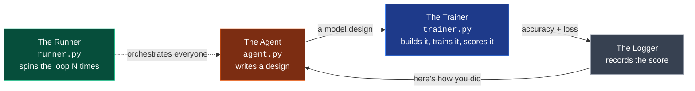
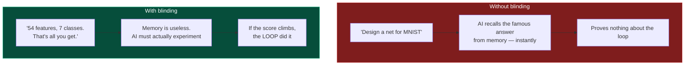

# Chapter 2 — Build Your First Loop

*The four parts, made real. You can run this one yourself. ~15 minutes.*

← [Back: What Is a Loop?](01-what-is-a-loop.md) · [Next: The Stopping Problem →](03-the-stopping-problem.md)

---

## The analogy: a chef with a blindfolded taster

Imagine a tiny restaurant with just two workers:

- A **Chef** who cooks a dish, tastes nothing, and just sends it out.
- A **Taster** who eats it, writes down a score out of 100, and slides the note back to the Chef.

The Chef reads the note — *"73, too salty"* — cooks a new version, and sends it back. Score by score, the dish climbs. Neither of them is a human genius; the *loop* between them is what produces a great dish.

That's exactly the shape of the software loop we're about to build. Swap "Chef" for an AI that writes code, and "Taster" for a program that runs the code and measures how good it is.

## The four parts, as real software

Every AITL loop, no matter how fancy, is built from four parts. Here they are as the four Python files in our proof-of-concept, which lives in [`experiments/aitl_blind_nas/`](../experiments/aitl_blind_nas/):



| Part | File | Its one job | Which "hat" from Ch 1 |
|------|------|-------------|------------------------|
| **The Agent** | `agent.py` | An AI that invents a machine-learning model design (in code) | Self-Generating |
| **The Trainer** | `trainer.py` | A sandbox that *runs* that code, trains the model, and measures accuracy | Self-Evaluating |
| **The Logger** | inside `runner.py` | Writes down every attempt and its score | (the memory) |
| **The Runner** | `runner.py` | Repeats the cycle, feeding each score back to the Agent | Self-Improving |

That's it. **Generator, evaluator, memory, orchestrator.** Master these four boxes and you understand every autonomous loop in this book — the later chapters just add *more* agents or a *smarter* stop rule.

## What actually happens each lap

Here's one full turn of the loop, in plain steps:

1. **The Agent proposes.** The AI writes out a neural-network design — how many layers, how wide, which optimizer, what learning rate — as a chunk of PyTorch code.
2. **The Trainer executes.** A local runner takes that code, builds the network, and trains it for a quick burst (just a few epochs — enough to see if it's promising).
3. **The Trainer measures.** It computes the **validation accuracy** and **loss** — hard numbers for "how good was this design?"
4. **The score goes back.** The Agent sees something like *"your last design hit 64% accuracy, and the loss flattened early."*
5. **The Agent adapts.** It reasons — *"flattening early means I should add BatchNorm and raise the learning rate"* — and writes a **new, different** design.

Then it all repeats. The magic isn't in any single lap; it's that lap #12 is informed by the 11 that came before it. That feedback is the loop *learning*.

> **A term, defined once:** *validation accuracy* is just "on data the model has never seen before, what fraction did it get right?" It's the honest score — testing on unseen data stops the model from just memorizing the answers. When it goes **up** over many laps, the loop is genuinely improving.

## The clever trick: blindfold the AI

Now here's a problem that took real cleverness to solve, and it's worth understanding because it's what makes this a *proof* and not just a demo.

Modern AIs have read the entire internet. If you ask one to "design a great network for MNIST" (a famous handwriting dataset), it doesn't need a feedback loop at all — it already **memorized** the best-known answer during training. It'll spit out a great design on the first try. That would prove the AI has a good memory. It would prove **nothing** about whether the *loop* works.

The fix is beautifully simple: **don't tell the AI what the data is.**

The researchers took a real dataset and stripped every clue from it. No name. No column labels ("age," "height" → just "feature 0," "feature 1"). The AI is told only the bare shape of the problem:

> `54 features, 7 classes. Go.`

That's it. It has no idea if it's looking at handwriting, medical scans, or forest sensor readings. Its memory is now useless. This is called **blinding** (the folder name, *Blind NAS*, means "Blind Neural Architecture Search" — searching for a network design, blindfolded).



Why this matters so much:

> If the AI is blindfolded and its accuracy **still climbs steadily over 20 rounds**, there's only one possible explanation: the feedback loop is *working*. The AI is genuinely learning from each result, not reciting a memorized answer. That rising curve is the mathematical proof that AITL's "self-improving" property is real.

(Under the hood, the dataset here is the UCI *Cover Type* set — forest data with 54 features and 7 tree-cover classes — but the AI never learns that name. You can read the full reasoning in [`concept.md`](../experiments/aitl_blind_nas/concept.md).)

## Run it yourself

You don't have to take any of this on faith. The proof-of-concept is small and runnable:

```bash
cd experiments/aitl_blind_nas
python runner.py
```

By default it drives the loop with OpenAI's `gpt-4o-mini` (set `OPENAI_API_KEY` first), but it can also run a **fully local, free** model instead — the top of [`runner.py`](../experiments/aitl_blind_nas/runner.py) shows how to point it at a local model via llama.cpp, no API key needed. It runs up to 50 laps.

When it finishes, look in the `results/` folder for the loss curve. Watch it trend **downward** over the iterations. That downward line is the whole thesis of Chapter 1 made visible: *an AI, learning from nothing but its own measured feedback.*

## So we're done, right?

You'd think so. We have a loop. It generates, it evaluates, it improves, and we can *prove* it's really learning. The human just presses "go" and watches.

But look back at that run command. Notice a quiet detail: `MAX_ITERATIONS = 50`. **Why is there a hard cap of 50?**

Because if you *don't* put one there... the loop doesn't stop.

We told the AI it could output `STOP` whenever it felt it was done. And in the very next chapter, across a dozen different AIs, we're going to watch what happens when a single model is left alone with that choice. It's the most important — and most surprising — finding in this whole book.

**[→ Chapter 3: The Stopping Problem](03-the-stopping-problem.md)**
