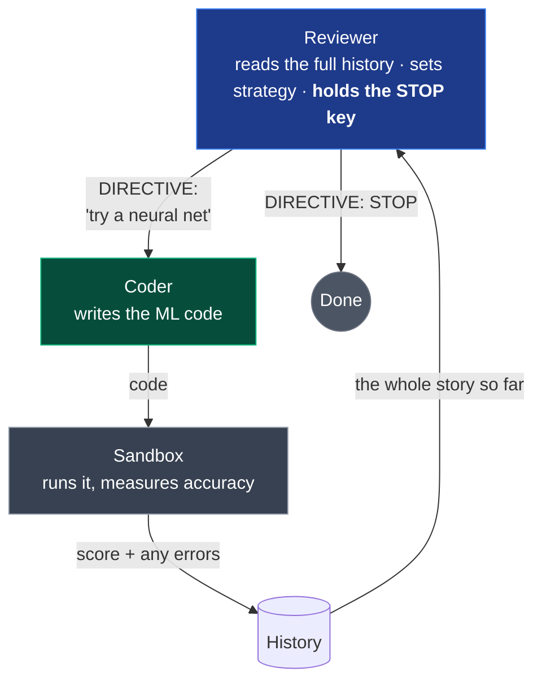
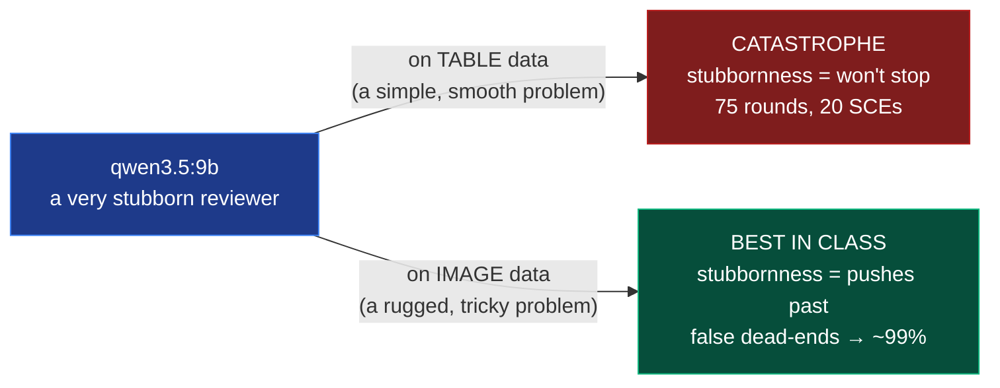

# Chapter 4 — Fixing It With Teams

*Fix #1: a committee of specialists. With a genuine plot twist. ~18 minutes.*

← [Back: The Stopping Problem](03-the-stopping-problem.md) · [Next: Fixing It With Math →](05-fixing-it-with-math.md)

---

## The analogy: one genius vs. a small committee

Picture two ways to crack a hard problem.

**Way one:** you hand it to a single brilliant expert and say *"think about this for ten minutes."* They think hard and deep. They give you an excellent answer — but it comes from **one point of view**. Wherever that expert has a blind spot, the answer has a blind spot too. And the longer they think alone, the more convinced they become that they've seen every angle.

**Way two:** you gather three *less* brilliant people — but each one knows a *different* corner of the problem well. They talk. One notices something the others missed. A second pushes back. And out of the friction comes a set of ideas, and a catch of mistakes, that no single thinker — however smart — would have produced alone.

This is not a new idea. It's why juries have twelve people, why companies have review boards, why "two heads are better than one" is a proverb in every language. There's even a precise version of it inside machine learning itself: a **random forest** — a crowd of mediocre little decision trees voting together — reliably beats a single deep, finely-tuned tree. **Diversity beats individual brilliance.**

The researcher put it with a phrase worth keeping:

> When you think alone, you believe you've seen every possibility. A different person — with different experiences — instantly spots what you missed. **Not because they're smarter, but because they're *differently wrong*.**

That phrase — *differently wrong* — is the entire fix in three words. Two minds that make **different** mistakes cover each other's blind spots. And that's exactly what the lonely model in Chapter 3 lacked: it was trapped in its own tunnel, using the same reasoning that got it stuck to judge whether it was stuck. It needed a second mind that was wrong in *different* ways.

## The fix: split the loop into two roles

So instead of one AI doing everything, the loop is split into **two different AIs with two different jobs**:

- **The Coder** — writes the machine-learning code. Its whole world is "build the thing the boss asked for." It does **no** big-picture thinking about whether to stop.
- **The Reviewer** — never writes a line of code. It watches the Coder's whole history, sets the strategy (*"stop tweaking trees, try a neural network"*), and — crucially — **holds the STOP key.** Only the Reviewer can end the loop.



Why does this break the sunk-cost trap? Because **the Reviewer isn't the one who "invested" in the failing idea.** The Coder might be emotionally down the rabbit hole of tweaking its Random Forest for the twelfth time — but the Reviewer is standing outside that hole, looking at the flat line on the chart, free to say the thing the Coder can't: *"This isn't working. Stop."* It's the bystander from the end of Chapter 3, finally hired.

Two design words worth knowing:

- This split is called an **asymmetric** loop — the two agents have *deliberately different* jobs and powers. (Symmetric would be two identical copies doing the same thing.)
- To make the "differently wrong" idea measurable, the research uses a score called **CADS** — *Cognitive Agentic Diversity Score* — which is just **how many genuinely different model families are on the team.** Two copies of the same model = CADS 1 (no diversity). A Qwen model paired with a Llama model = CADS 2 (real diversity). Higher CADS = more different blind spots covered.

## Does it work? The numbers say yes — dramatically

This was tested across **132 runs**, on three kinds of data. Start with the structured-table task, where the story is cleanest.

Recall the lonely models from Chapter 3. The best *single* agent on this task (`llama3.1:8b`) did reach a high accuracy of **94.92%** — but look at the cost of getting there:

| Setup | Accuracy | Time | Sunk-cost episodes |
|---|:---:|:---:|:---:|
| **Best lonely model** (`llama3.1:8b`) | 94.92% | **3,432 sec** | **8.7** (badly stuck) |
| **Best two-agent team** (`qwen-coder:14b` + `deepseek-coder:16b`) | 93.73% | **330 sec** | **0.0** (never stuck) |

Read the trade. The team scored a *whisker* lower on raw accuracy — **98.7% of the lonely model's score** — but it got there in **about a tenth of the time** (330 seconds vs 3,432), and it **never once fell into a sunk-cost episode.** The headline, in the researcher's words:

> **98.7% of the accuracy, at 9.6% of the compute cost.**

And it wasn't a lucky pairing. Across the team configurations tested, **7 out of 9 fell into *zero* sunk-cost episodes.** The Reviewer, standing outside the tunnel, systematically killed the trap that no lonely model could escape.

One more detail proves it's the *diversity* doing the work, not just "having a second model." When the team was two **identical** copies (CADS 1), it scored 92.81%. Swapping one copy for a genuinely **different** model family (CADS 2) added roughly **+0.9%**. Any second opinion helps a little; a *differently-wrong* second opinion helps more. Exactly the committee effect.

> **The takeaway:** a team of two small, cheap, *different* models beats one bigger model working alone — not always on the last decimal of accuracy, but overwhelmingly on **cost, speed, and reliability.** For anyone actually deploying an autonomous loop, that trade is the whole ballgame.

## The plot twist: the "worst" reviewer was secretly the best

Here's where the research gets genuinely surprising — and where it stops being a tidy fairy tale.

One model, `qwen3.5:9b`, was an **absolute disaster** as a Reviewer on the table data. Instead of calming the loop down, it was the *stubbornest* agent in the whole study: **75 rounds, 20.3 sunk-cost episodes**, straight into the safety wall. As a stopper, it was the worst of the bunch — its persistence was pure liability.

But then the same model was put in charge of an **image** task. And it became the **best Reviewer tested** — reaching the top accuracy of the entire experiment (**up to 99% on the paired run**). The *exact same stubbornness* that ruined it on tables made it excellent on images.

How can one trait be both the worst and the best? The researchers call this the **Modality Paradox** ("modality" just means *the kind of data* — tables vs. images vs. text):



- On **simple, smooth** problems (tables), where the best answer is found quickly, stubbornness is a curse — it just means you refuse to stop after you've already won.
- On **rugged, tricky** problems (images), progress comes in fits and starts, with lots of false "dead ends" that you have to *push through* to find the real gains. Here, stubbornness is a **virtue** — a patient agent breaks through walls that a quitter would've given up at.

> **The deep lesson:** there is no single "best" agent, and no single "right" amount of persistence. **The right behavior depends on the shape of the problem.** A trait that's a fatal flaw in one setting is a superpower in another. This is why a truly autonomous system can't be hardcoded once and forgotten — it needs to *sense what kind of problem it's facing* and adjust. (That idea is exactly what Chapters 5 and 6 build toward.)

## The honest failure: teams flopped on text

A guide that only showed you the wins would be lying to you. So here is the result that **didn't work**, kept in on purpose.

On **text** data, the two-agent team **lost** — and not by a little. The best team scored **81.16%**, while the best *lonely* model scored **89.88%**. The team was **8.7 percentage points worse.**

Why? It traces straight back to the Reviewer's job. On tables, progress is smooth — a flat line really does mean "you're stuck, stop." But text is different. Improving a text model often needs a **semantic leap**: several rounds of setup that show *zero* improvement, and *then* a breakthrough. To the Reviewer watching the chart, that necessary flat stretch looks *identical* to a sunk-cost trap. So it does its job too well — it calls STOP right before the payoff, and never lets the Coder reach the good part.

> The reviewer's superpower (killing flat, stuck loops) becomes its weakness on problems where **flat doesn't mean stuck.** The fix from Chapter 4 has a real edge, and honesty demands we mark it on the map.

*(The researchers also tested a three-agent version — a Reviewer, a Coder, and a separate Judge — as a further step. But even three heads don't escape the core issue: the whole team is still deciding when to stop using **words and judgment**, and words can be argued with. That limitation is the doorway to Chapter 5.)*

## Run it yourself

The two-agent loop is real code you can drive. The runnable versions live in [`aeos_sunk_cost/`](../aeos_sunk_cost/):

- [`runner_critic.py`](../aeos_sunk_cost/runner_critic.py) — the **two-agent** (Reviewer + Coder) loop
- [`runner.py`](../aeos_sunk_cost/runner.py) — the lonely **single-agent** baseline, for a side-by-side comparison
- [`runner_boundless.py`](../aeos_sunk_cost/runner_boundless.py) — the extended-horizon variant that lets a model loop for a long time (this is how the sunk-cost episodes in Chapter 3 were captured)

```bash
cd aeos_sunk_cost
python runner_critic.py # the Reviewer + Coder team
```

The exact prompts that turn one model into a "Reviewer" and another into a "Coder" are printed in full in the [AEOS README](../aeos_sunk_cost/README.md) — worth a look to see how little it takes to assign these roles. The full Paper 3 experiment design (including the three-agent Reviewer-Coder-Judge variant and the cross-modality sweeps) is documented in [`experiments/modality_paradox/`](../experiments/modality_paradox/).

## Where we are now

We've come a long way:

- A **lonely model can't stop** (Chapter 3).
- A **team with a Reviewer holding the STOP key** fixes it — *massively* cheaper and more reliable, if slightly less accurate on easy problems.
- But the right *kind* of teammate **depends on the problem** (the Modality Paradox), and the team **fails on text**, because its stop-signal misreads necessary flat stretches as dead ends.

Notice the thread connecting every remaining weakness. The Reviewer decides when to stop by **looking at the situation and using its judgment** — in words. And judgment in words can be *wrong*, and can be *argued with*. On text, its worded judgment misfires. Even the best Reviewer is still, fundamentally, *guessing* — a smarter guess than the lonely model's, but a guess.

What if the stop decision didn't come from words and judgment at all? What if it came from a **number the AI computes about itself** — a number it can't talk its way out of?

That's the final fix.

**[→ Chapter 5: Fixing It With Math](05-fixing-it-with-math.md)**

---

*Sources for this chapter: [Paper 3 — The Modality Paradox](../paper/paper3_modality_paradox/Paper3_Draft.md) (the 132-run study, CADS, the qwen3.5:9b paradox, and the honest text negative). Numbers are averages across repeated runs; see the full leaderboards in the paper draft.*
