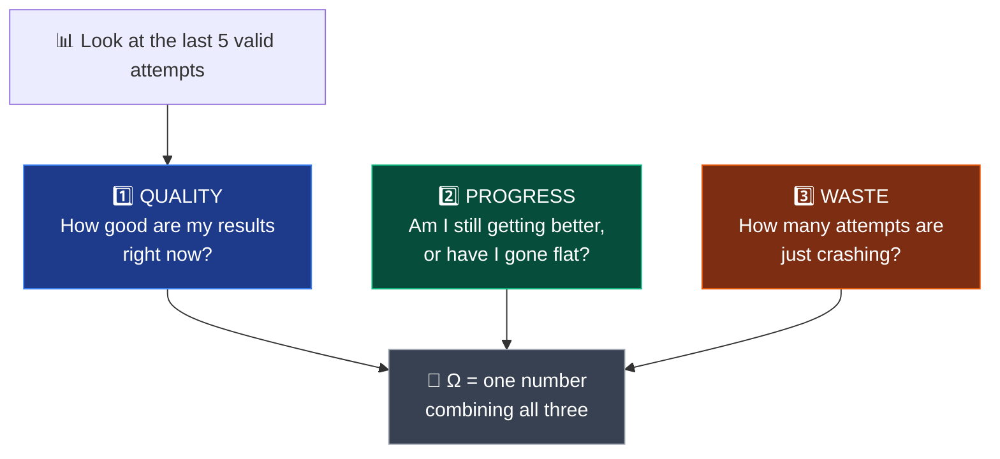
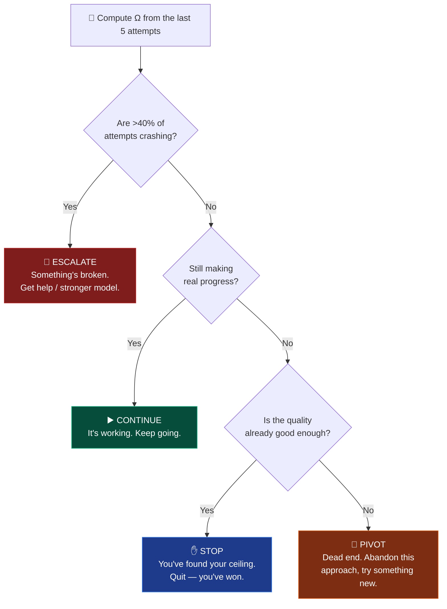

# Chapter 5 — Fixing It With Math

*Fix #2, the cleanest one: proof beats talk. Meet Omega (Ω). ~15 minutes.*

← [Back: Fixing It With Teams](04-fixing-it-with-teams.md) · [Next: What's Next →](06-whats-next.md)

---

## The analogy: proof beats talk

Think about how you actually change your mind.

If a friend simply *tells* you *"trust me, this stock will crash"* — no evidence, just words — you shrug it off. But if they show you the **numbers**, the charts, the hard proof, you take it seriously. The smarter and more careful a person is, the more they lean on this rule: **demand proof, don't just take talk.**

Now apply that to an AI stuck in the sunk-cost trap. Every fix so far has been a form of *talk*:

- Chapter 3's lonely model was **told** in its instructions, *"stop if you're not improving."* It just... argued with the instruction and kept going.
- Chapter 4's Reviewer was a smarter voice, but it still **said** *"I think we should stop"* — a judgment, in words, that could be (and on text, was) wrong.

Here's the trap underneath all of it, stated plainly:

> You're asking the AI to use **the very same reasoning that is currently failing** to judge whether it's failing.

It's like asking someone deep in the sunk-cost fallacy — *"should you keep pouring money into this losing project?"* — to rationally assess their own bias. The answer is almost always *"yes, just a little more,"* because the mind making the judgment is the same mind that's compromised. Words can't fix words.

So the researcher made a leap:

> **If you can't trust the AI's talk to stop it, give it a number it can't argue with.**

Don't *ask* the AI *"are you satisfied?"* Make it **compute a score from its own results** — a hard number, derived from what actually happened — and let the number decide. As the paper puts it: *"Numbers do not have cognitive biases."* You can talk yourself out of a feeling. You cannot talk yourself out of arithmetic.

That number is called **Omega**, written **Ω** — and in the published research (Paper 3) it goes by the name **Cognitive Yield**: a score for how much *real* progress your recent work actually yielded. (Fun bit of history: the symbol "Ω" was suggested by an AI. But the *idea* — force the machine to prove things to itself instead of talking to itself — came straight from that human insight: proof beats talk.)

## What Omega measures: three honest questions

Omega looks back at the AI's **last few valid attempts** (5 of them, by default — a small recent window) and asks three simple questions about them. Each becomes a number.



| # | Question | Plain meaning | Name in the formula |
|---|----------|---------------|:---:|
| 1️⃣ | **Quality** | Average accuracy of my recent good runs | `Q_valid` |
| 2️⃣ | **Progress** | How much my recent best beats my previous best | `P_gain` |
| 3️⃣ | **Waste** | What fraction of my recent attempts crashed | `R_waste` |

Then it blends them into a single score. Here's the actual formula — don't be scared, it's just "add up the good, subtract the bad":

$$\Omega = \underbrace{0.3 \times \text{Quality}}_{\text{how good}} + \underbrace{0.6 \times \text{Progress}}_{\text{still improving?}} - \underbrace{0.1 \times \text{Waste}}_{\text{crashing?}}$$

The three multipliers (0.3, 0.6, 0.1) are just how much each question *counts*. And notice which one counts the most: **Progress, at 0.6.** That's a deliberate, almost philosophical choice:

> A model at 90% and **still climbing** is worth more than a model stuck at 91% that has **stopped moving.**
> Momentum matters more than the current height. *(Where you're going beats where you are.)*

Quality matters, but less. And waste (crashes) is a mild penalty — a few errors while exploring are fine.

## The number picks one of four actions

This is the part that takes the choice *away* from the AI's biased judgment. Once Omega is computed, a fixed rule maps it to **one of four actions** — no discussion, no "but maybe one more try":



- **▶️ CONTINUE** — still improving, so keep going.
- **✋ STOP** — not improving *and* quality is already good → you've hit your ceiling, put the pencil down. **This is the apple-drawer finally stopping** — but triggered by a number, not a feeling.
- **🔀 PIVOT** — not improving *and* quality is poor → this whole approach is a dead end; throw it out and try something genuinely different.
- **🚨 ESCALATE** — too many crashes → something's structurally broken; don't just retry, get help (a human, or a more powerful model).

The beauty is that STOP is no longer a *feeling* the AI has to be brave enough to admit. It's the output of a rule. The AI computes 0.258, the rule says STOP, and it stops. It literally cannot rationalize its way past a number the way it could rationalize past the sentence *"stop if you're not improving."*

> This also quietly upgrades the old binary "keep going / stop" into **four** smart moves. The AI can now tell the difference between *"I've won, stop"* (STOP) and *"I'm losing, change everything"* (PIVOT) — two situations the lonely model of Chapter 3 hopelessly blurred together.

## It caught a failure in the real world

This isn't just theory on paper — an early version runs today, and it has already caught something the lonely models of Chapter 3 would have blindly looped on forever. Here's a real line from its logbook:

```
Final Action: ESCALATE
Omega: Q=0.0000, P=0.0000, R=0.8684, O=-0.0868
```

Read it now — you can decode this yourself:

- `R=0.8684` → **87% of the recent attempts were crashes.** The loop was flailing.
- `Q=0.0000, P=0.0000` → with almost nothing running successfully, there was no quality and no progress to speak of.
- `O=-0.0868` → Omega went **negative.** A number that says, unmistakably, *"this is going badly."*
- The waste blew past the 40% line, so the rule fired **ESCALATE** — *"I'm broken, get help,"* instead of quietly wasting hours retrying.

A Chapter-3 lonely model, in that exact situation, would have kept slamming into the same crash, blind to its own failure. Omega saw the number and raised its hand. **That's proof beating talk, working.**

## Why this is the cleanest fix of all three

Step back and compare the three stop mechanisms this book has shown you:

| Mechanism | Who decides to stop | The weakness |
|---|---|---|
| **Ch 3 · Lonely model** | The model's own judgment, in words | It's biased and argues itself out of stopping |
| **Ch 4 · Reviewer** | A *second* model's judgment, in words | Better, but still a *guess* — misfires on text |
| **Ch 5 · Omega** | **A number computed from real results** | Can't be argued with — but the formula's dials must be tuned |

Each fix moved the stop decision **further from opinion and closer to evidence.** Omega is the end of that road: the decision is arithmetic over what *actually happened*, not a story the AI tells itself about what *might* happen next.

## An honest caveat

Omega is powerful, but it's not magic, and this guide doesn't pretend otherwise:

- Those dials — the weights (0.3, 0.6, 0.1) and the thresholds (like the 40% crash line) — have to be **tuned**, and the right settings may differ by problem. Remember the Modality Paradox from Chapter 4: tables, images, and text each want *different* patience. Omega inherits that; its thresholds should probably shift per data type too.
- And a note on where this stands: the **Cognitive Yield (Ω) idea is published** — it's part of Paper 3, tested there with a dedicated "math-prompt" study. What's *still being built* is the fully-automated engine that computes Ω every few rounds and runs the four actions on its own, with no human in the loop at all. That engine lives in the sibling `aeos-lab` code (where the logbook line above came from), and it's the frontier the final chapter explores.

## Where we are now

We've reached the top of the arc:

- One lonely model **couldn't stop** (Ch 3).
- A team with a Reviewer **could stop** — via smarter *talk* (Ch 4).
- Omega lets the AI **prove to itself** that it's time to stop — via a *number* it can't argue with (Ch 5).

From "give a goal and hope," we've built our way to a system that **knows — not just intuits — when to stop, pivot, or escalate.**

So... is autonomy solved? Not quite. There's a bet the researcher believes but *hasn't been able to prove yet*, and there's a genuine open frontier past Omega. The last chapter is about what's still unknown — and it hands you an experiment you could run to help settle it.

**[→ Chapter 6: What's Next](06-whats-next.md)**

---

*Sources for this chapter: **Paper 3 — The Modality Paradox** ([Zenodo](https://zenodo.org/records/20364204)), which introduces the math-based stopping score as **Cognitive Yield (Ω)** and tests it with a math-prompt study. The full formula and the four-action engine (including the ESCALATE logbook line above) are implemented in the sibling `aeos-lab` project, where Ω is being built into a complete self-running system.*
