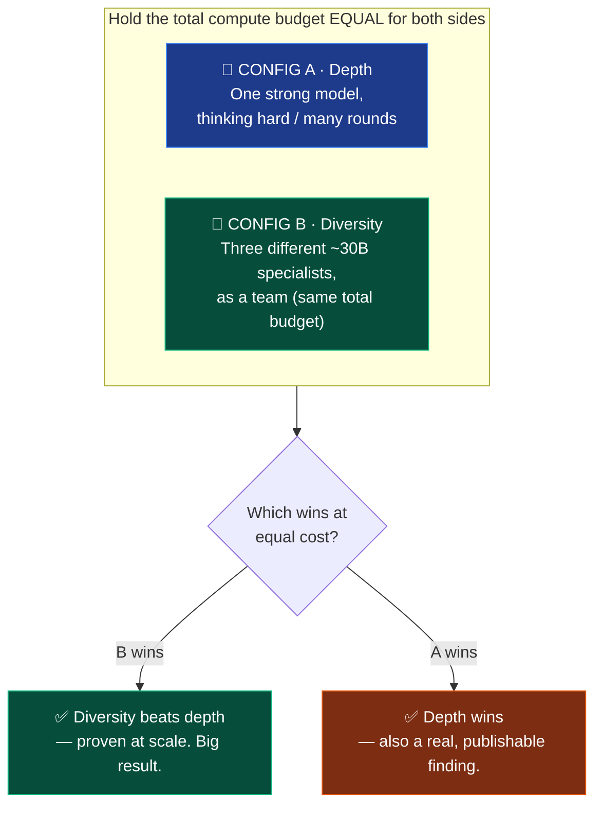

# Chapter 6 — What's Next

*The open frontier — and an experiment you could run. ~12 minutes.*

← [Back: Fixing It With Math](05-fixing-it-with-math.md) · [Back to Contents](README.md)

---

## Where the story has taken us

Four chapters ago, we had a single AI that couldn't put the pencil down. Now we have three real ways to make an autonomous loop *know when to stop*:

But the honest truth of any real research is that the end of the map is not a wall — it's a coastline with fog past it. This chapter is about that fog: two big open directions, one of which is a bet you could go help settle *today*.

## Frontier 1: the Lab Director — a loop that runs the loops

Omega (Chapter 5) started as a *stop button*. But look again at its four actions — CONTINUE, STOP, PIVOT, **ESCALATE** — and you'll notice it's quietly become something bigger: a **traffic controller** for the whole system.

The idea being built right now (in a sibling project called `aeos-lab`, under the name **The Lab Director**) is a manager that sits *above* the loop and uses Omega's number to make routing decisions:

- Omega says **CONTINUE** → let the current cheap, local team keep working.
- Omega says **PIVOT** → swap in a *different* kind of model (raise the diversity — remember CADS from Chapter 4).
- Omega says **ESCALATE** → the local team is stuck or crashing, so **spend real money**: hand the job up to a powerful frontier model (GPT, Claude), but *only now*, when it's actually worth it.

That last move is the clever part. It turns "when should I pay for the expensive model?" from a guess into an **economic rule**: stay cheap and local while Omega says things are going fine; only escalate to the costly frontier model when the number proves you're stuck *and* the task is important enough to justify the bill. A closed loop, sitting on top of a closed loop — the AI managing its own budget.

The scoring idea itself — Cognitive Yield (Ω) — is already published in Paper 3. The **meta-orchestrator that acts on it automatically** is the new, unpublished part being built here. It's where "an AI that knows when to stop" grows into "an AI that runs its own research lab."

## Frontier 2: the big bet — *does diversity beat depth?*

Here's the most exciting open question in the whole project, and it's stated honestly as what it is: **a strong belief that has not yet been proven.**

Recall the committee idea from Chapter 4 — *differently-wrong* minds beat one lone genius. The whole AI industry is currently betting the *opposite* way. Every major lab is pouring billions into making **one** model **think harder** (longer reasoning, "extended thinking," bigger and bigger single brains). That's the "one genius, thinking for ten minutes" approach.

The researcher's bet is the committee approach, scaled up:

> Take a very strong model thinking hard, all alone.
> Now take **three medium-sized (~30-billion-parameter) specialist models**, each good at a different thing, working together as a team.
> **The bet: the three specialists beat the lone genius** — because diversity of perspective beats depth of a single perspective.

Why believe it? Because we already saw the **small-scale version work** in Chapter 4: two *different* 7-billion-parameter models (CADS 2) beat two identical copies (CADS 1). The committee effect is real at small size.

Why isn't it proven at big size? An honest, human reason:

> **The researcher didn't have a big enough GPU.** Testing three 30-billion-parameter models at once needs hardware that wasn't available, so every experiment in this book was capped at ~7-billion-parameter models. The big claim is grounded in a real analogy and real small-scale evidence — but it is **untested at the scale that would prove it.**

That's not a weakness to hide. It's an open door.

## An experiment *you* could run

Here's the best part of an honest open question: it comes with a recipe. And the hardware excuse has an escape hatch — you don't need to *own* a giant GPU anymore. You can **rent** 30B+ models by the token through hosted APIs (Together, Fireworks, DeepInfra, OpenRouter, Groq, and others). A pilot costs **tens of dollars, not thousands**.

If you want to actually push this field forward, here's the protocol — designed so the result *means something*:

The rules that make it trustworthy:

1. **Equal budget.** Give both sides the *same* total token/dollar budget. Otherwise you're just testing "who got to spend more."
2. **Pin the model versions.** Hosted models change silently over time — record the exact model IDs so someone else can reproduce it.
3. **Run it several times.** This whole field is about *variance* in stopping behavior; one run proves nothing. Use multiple seeds.
4. **Keep the blindfold.** Use the same dataset-blinding trick from Chapter 2, or you're testing the models' memories instead of the loop.
5. **Use open ~30B models for the core test.** (Frontier APIs like GPT/Claude are a different animal — huge *and* heavily aligned — so use them only as a "ceiling" reference, not as the diversity comparison itself.)

Either outcome is a real contribution. If the committee wins, it challenges the entire industry's "just think harder" bet. If the lone genius wins, that's a genuine, honest finding too. **A negative result is still a result** — this whole book has one (the text failure in Chapter 4), and it's more valuable than a comfortable guess.

## The limits, stated plainly

Good research is loud about what it *hasn't* shown. To recap the honest edges of everything in this book:

- **Most accuracy leaderboards are single runs.** The *stopping-behavior* claims were repeated 2–3 times and are solid; the exact accuracy decimals should be read as ballpark, not gospel.
- **The team fix fails on text** (Chapter 4). It's an edge of the map, not a universal solution.
- **Memorization can never be 100% ruled out.** Blinding makes cheating very hard, but the only airtight proof would be training a model from scratch on data that was never public.
- **The 30B "diversity beats depth" claim is unproven** — the whole point of the experiment above.
- **The fully-automated Ω engine is still being built** (Chapter 6). The Cognitive Yield (Ω) idea is published in Paper 3, but the self-running meta-orchestrator on top of it is not finished.

None of this weakens the core story. It sharpens it. The central finding — *an AI in a loop can't stop on its own, and here are three real ways to engineer that stop* — stands on repeated, honest experiments.

## The one sentence to carry with you

> **Autonomy is not the default state of an AI in a loop. It is something you build — and the hardest, most overlooked part of building it is teaching the machine when to stop.**

You now understand *why* that's hard (the sunk-cost trap), and *three* ways to solve it: **a team** that watches from outside the tunnel, **a number** the AI can't argue with, and — maybe next — **a committee of specialists** that outthinks a lone giant.

That's the whole journey, from zero to the frontier. The pencil is in your hand now.

---

## Keep going

- 🧠 **Read the real papers** — the rigorous versions of everything here:
  [Paper 1 · Taxonomy](https://zenodo.org/records/19551173) · [Paper 2 · Sunk-Cost](https://zenodo.org/records/19846960) · [Paper 3 · Modality Paradox](https://zenodo.org/records/20364204) *(includes the Cognitive Yield / Ω fix)*
- 🧪 **Run the code** — [`experiments/`](../experiments/) and [`aeos_sunk_cost/`](../aeos_sunk_cost/) hold every loop in this book.
- 🔬 **See the frontier** — the sibling `aeos-lab` project is where Omega and the Lab Director are being built right now.
- 📖 **Confused by a word?** Everything is defined in the [Glossary](glossary.md).

*Part of the Neuralchemy Labs research series — [neuralchemy.in](https://www.neuralchemy.in/). Built by Sanskar Jajoo.*
