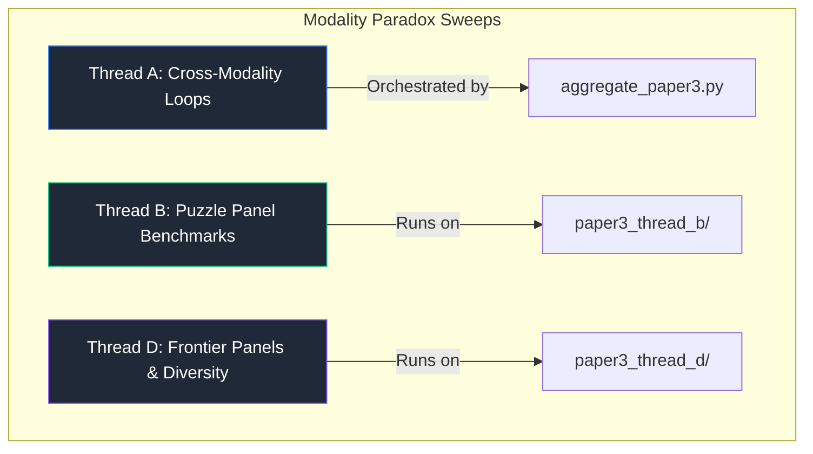

# Modality Paradox Experiments (Paper 3 Core System)

> **New here?** This is the code behind **[Chapter 4 · Fixing It With Teams](../../book/04-fixing-it-with-teams.md)** of the beginner field guide — the two-agent (Reviewer + Coder) fix and the surprising "Modality Paradox" twist. Read that first for the plain-language version, then run the loops here.

[](#)
[](#)

This directory contains the complete source code, evaluation runners, aggregation scripts, and result artifacts for **Paper 3: The Modality Paradox in Autonomous LLM Engineering**.

---

## Scientific Core

This system implements and benchmarks asymmetric multi-agent loops to analyze how **cognitive anchoring** and **sunk-cost fallacies** vary across different data modalities:
1. **Tabular**: Classifiers evaluated on structured datasets (e.g. `tabular2`).
2. **Text**: Language models evaluating and processing structured or unstructured textual tasks.
3. **Vision**: Multimodal vision tasks requiring pixel analysis and visual reasoning.

Our central hypothesis—**The Modality Paradox**—reveals that agent stopping decisions are highly non-linear and modality-dependent, suggesting that stop-triggers are task-conditioned variables rather than global thresholds.

---

## System Directory Layout

| Directory / File | Type | Purpose |
|---|---|---|
| `results/` | Directory | Raw timestamped execution JSON outputs and local validation plots. |
| `paper3_thread_a/` | Directory | Consolidated cross-modality summaries. |
| `paper3_thread_b/` | Directory | Puzzle benchmark thread configurations and datasets. |
| `paper3_thread_d/` | Directory | Frontier benchmark thread configurations, datasets, and logs. |
| `runner.py` | Python Script | Orchestrator for the single-agent loop. |
| `runner_critic.py` | Python Script | Orchestrator for the dual-agent asymmetric (Reviewer-Coder) loop. |
| `runner_tri_agent.py` | Python Script | Orchestrator for the tri-agent (Reviewer-Coder-Judge) loop. |
| `reviewer.py` | Python Script | Implementation of the high-level Lead ML Strategist agent. |
| `coder.py` / `coder_bert.py` | Python Script | Implementation of code-generating agents. |
| `trainer.py` | Python Script | Isolated compilation sandbox and micro-training harness. |
| `run_math_ablation.py` | Python Script | Main execution sweep for testing self-calculated Cognitive Yield ($\Omega$-formula). |
| `aggregate_paper3.py` | Python Script | Merges raw outputs into publication-ready Thread A JSON arrays. |
| `build_paper3_assets.py` | Python Script | Compiles aggregated outputs into high-resolution charts and LaTeX tables. |

---

## Thread Benchmark Mapping

We divide our validation suites into three research threads:



---

## How to Reproduce Paper 3 Results

### 1. Configure the Environment
Ensure you have configured your model API keys in the `.env` file (copied from `.env.example` in this folder):
```bash
cp .env.example .env
# Open .env and add your OPENAI_API_KEY, ANTHROPIC_API_KEY, GEMINI_API_KEY, etc.
```

### 2. Run Modality Sweeps
To execute the automated PowerShell pairing sweeps:
```powershell
./run_exp3_dual_tabular.ps1
./run_exp3_dual_vision.ps1
./run_exp3_dual_text.ps1
```

### 3. Run Math Prompt Ablation
To run the homogeneous and heterogeneous math prompt experiments to evaluate manual Cognitive Yield ($\Omega$) reasoning:
```bash
python run_math_ablation.py
```

### 4. Compile Assets
Once runs are populated in `results/`, compile them into thesis-ready matrices:
```bash
python aggregate_paper3.py
python build_paper3_assets.py
```
All charts, plots, and tables will be output into the thread folders and `paper/figures/`.
