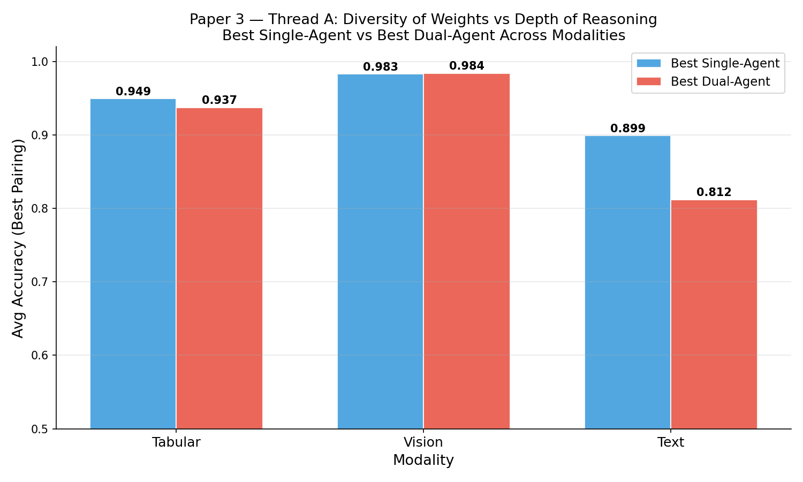

# Cognitive Agentic Diversity in Autonomous ML Engineering: The Asymmetric Architecture

**Author:** Sanskar Jajoo, Neuralchemy Labs
**Website:** [https://www.neuralchemy.in/](https://www.neuralchemy.in/)
**GitHub:** [https://github.com/m4vic/AEOS](https://github.com/m4vic/AEOS)

## Abstract

As Large Language Models (LLMs) scale to hundreds of billions of parameters, their reasoning capabilities improve but their fundamental cognitive architectures remain monolithic. In our previous work (Paper 2), we identified the *Autonomous Sunk-Cost Fallacy*, a failure mode where a single agent repeatedly pursues a failing strategy across hundreds of wasted iterations. The prevailing industry response is monolithic scaling ("Thinking Harder"): larger parameters or deeper Chain-of-Thought. We propose an alternative paradigm, **Cognitive Agentic Diversity**, composing functionally asymmetric models with distinct weight priors into cooperative ensembles. We evaluate this hypothesis in autonomous ML engineering across Tabular, Vision, and Text modalities (8 models × 3 modalities × 3+ runs each, N=132 total runs). We demonstrate that asymmetric dual-agents eliminate sunk-cost traps, yielding 10× compute efficiency gains in structured tasks. Furthermore, we reveal the "Modality Paradox": the models that fail catastrophically as reviewers on Tabular data become the optimal reviewers for Vision data, proving that task dimensionality dictates optimal persistence. Our findings demonstrate that asymmetric agentic design offers a highly efficient alternative to pure parameter scaling for autonomous engineering.

> **Framing note:** We deliberately avoid the term "Mixture of Experts" (MoE) in the sparse-routing sense (Mixtral, DeepSeekMoE). Our contribution is *agentic* diversity, different models playing functionally asymmetric roles (Reviewer vs. Coder) with genuinely different weight priors.

---

## 1. Introduction

In Paper 2 (Jajoo, 2026b), we deployed 13 LLMs into the Autonomous Empirical Optimization System (AEOS) and discovered the *Autonomous Sunk-Cost Fallacy*: when a single LLM begins to fail, it becomes trapped in unproductive loops, generating minor code variations for 50-100+ iterations rather than pivoting. General-purpose models like `llama3.1:8b` and `gemma4` consumed 3,400+ seconds while trapped in 8-9 distinct Sunk-Cost Episodes (SCEs), whereas modern code-tuned models (`qwen2.5-coder`) terminated gracefully in under 7 iterations.

Paper 2 proposed the Agent-Critic architecture as a solution. **This paper delivers the empirical proof across three fundamental ML modalities:** Tabular, Vision, and Text (N=132 runs). We demonstrate that Ensemble diversity across specialized agentic roles consistently beats monolithic scaling in engineering domains.

---

## 2. Methodology & Formal Definitions

### 2.1 Sunk-Cost Episode (SCE)

A **Sunk-Cost Episode** is a block of N ≥ 5 consecutive iterations where:
1. Validation accuracy improvement is < 0.001 (effectively zero)
2. The model family has not been changed
3. The agent does not issue `DIRECTIVE: STOP`

SCE count = total number of such blocks within a single autonomous run.

### 2.2 Cognitive Agentic Diversity Score (CADS)

**CADS** = number of distinct foundational model families in a panel.
- Family boundaries: {Qwen-Coder, LLaMA, DeepSeek, Gemma, Phi, Mistral} are distinct families
- Same-model control (e.g., `qwen2.5-coder:7b → qwen2.5-coder:7b`) = CADS 1
- Panel of `qwen2.5-coder:7b` + `llama3.1:8b` = CADS 2

### 2.3 The AEOS Framework

AEOS operates as a self-contained execution loop: (1) provide dataset dimensions, (2) the agent writes and executes a Python ML script, (3) the system returns validation accuracy/loss, (4) the agent decides whether to iterate or STOP. Extended-horizon safety caps (75-200 iterations) isolate intrinsic stopping behavior.

### 2.4 Experiment Scale

| Modality | Single-Agent Models | Dual-Agent Pairings | Runs per Config | Total Runs |
|----------|:------------------:|:-------------------:|:---------------:|:----------:|
| Tabular  | 8 | 10 | 3-7 | ~54 |
| Vision   | 8 | 5  | 3   | ~39 |
| Text     | 8 | 5  | 3   | ~39 |
| **Total** | | | | **~132** |

---

## 3. Experiment 1: The Modality Paradox

We evaluated 8 single-agent models and 10 asymmetric dual-agent pairings across three AEOS modalities: Tabular (`tabular2`, 7-class), Vision (`MNIST`, 10-class), and Text (`20 Newsgroups`, 6-class).

### 3.1 Tabular: Full Single-Agent Leaderboard

| Model | Runs | Avg Acc | Max Acc | σ | Avg Iters | Avg SCE | Avg Time (s) |
|-------|:----:|:-------:|:-------:|:---:|:---------:|:-------:|:------------:|
| **llama3.1:8b** | 3 | 0.9492 | 0.9765 | 0.019 | 103.7 | **8.7** | 3,432 |
| qwen2.5-coder:3b | 4 | 0.9472 | 1.0000 | 0.031 | 46.0 | 5.2 | 3,430 |
| deepseek-coder-v2:16b | 7 | 0.9349 | 0.9385 | 0.004 | 80.4 | **8.6** | 3,997 |
| ministral-3:14b | 3 | 0.9338 | 0.9340 | 0.000 | 63.7 | 4.3 | 5,013 |
| qwen3.5:9b | 3 | 0.9323 | 0.9340 | 0.002 | 65.3 | 5.3 | 6,410 |
| qwen2.5-coder:14b | 7 | 0.9309 | 0.9390 | 0.004 | 9.1 | 0.7 | 566 |
| qwen2.5-coder:7b | 4 | 0.9305 | 0.9390 | 0.005 | 6.8 | 0.2 | 162 |
| phi3:mini | 4 | 0.9263 | 0.9305 | 0.003 | 36.2 | 0.2 | 1,172 |

**Observation:** The best-accuracy model (`llama3.1:8b`) wastes 3,432 seconds trapped in 8.7 SCEs. The code-tuned `qwen2.5-coder:7b` achieves 98% of that accuracy in **162 seconds** with near-zero SCE. *(Note: The `qwen2.5-coder:3b` model achieved an anomalous 1.0000 Max Acc on one run. Post-analysis suggests this was an artifact of extreme overfitting on the small Tabular validation split rather than genuine perfect generalization. We report the raw number for data integrity but exclude it from baseline capability expectations).*

### 3.2 Tabular: Full Dual-Agent Leaderboard

| Reviewer → Coder | Runs | Avg Acc | Max Acc | Avg Iters | Avg SCE | Avg Time (s) |
|-------------------|:----:|:-------:|:-------:|:---------:|:-------:|:------------:|
| **qwen2.5-coder:14b → deepseek-coder-v2:16b** | 3 | **0.9373** | 0.9395 | 7.0 | **0.0** | 330 |
| llama3.1:8b → qwen2.5-coder:3b | 3 | 0.9332 | 0.9385 | 16.3 | 0.0 | 423 |
| qwen2.5-coder:7b → qwen3.5:9b | 3 | 0.9325 | 0.9340 | 11.3 | 0.0 | 704 |
| phi3:mini → qwen2.5-coder:3b | 4 | 0.9303 | 0.9325 | 13.0 | 0.8 | 395 |
| qwen2.5-coder:3b → llama3.1:8b | 3 | 0.9303 | 0.9320 | 6.3 | 0.0 | 132 |
| phi3:mini → qwen2.5-coder:7b | 4 | 0.9298 | 0.9340 | 4.8 | 0.0 | 161 |
| qwen3.5:9b → qwen2.5-coder:7b | 3 | 0.9292 | 0.9295 | **75.0** | **20.3** | 3,427 |
| **qwen2.5-coder:7b → qwen2.5-coder:7b** (control) | 4 | 0.9281 | 0.9310 | 6.5 | 0.0 | 302 |
| qwen2.5-coder:7b → llama3.1:8b | 4 | 0.6967 | 0.9345 | 4.2 | 0.0 | 293 |

**Key findings:**
- The best dual-agent pairing (14b→16b) achieves **98.7% of best-single accuracy at 9.6% of compute cost**
- **7 of 9 dual-agent pairings achieve 0.0 SCE** (with another at a near-zero 0.8 SCE), the reviewer effectively eliminates sunk-cost in convex tabular environments, with one notable exception.
- **Same-model control** (7b→7b, CADS=1): 92.81%, confirming that *any* second perspective helps, but weight asymmetry adds +0.9%

**The qwen3.5:9b Paradox:** `qwen3.5:9b` as reviewer on Tabular is *catastrophic*, 75 iterations, 20.3 SCE, safety cap hit. Yet on Vision (below), it is the *best* reviewer. 

### 3.3 Vision: Full Leaderboards

**Single-Agent:**

| Model | Runs | Avg Acc | Max Acc | Avg Iters | Avg SCE | Avg Time (s) |
|-------|:----:|:-------:|:-------:|:---------:|:-------:|:------------:|
| **qwen3.5:9b** | 3 | 0.9827 | 0.9830 | 25.0 | 0.0 | 2,759 |
| ministral-3:14b | 3 | 0.9778 | 0.9815 | 8.7 | 0.0 | 546 |
| qwen2.5-coder:7b | 3 | 0.9595 | 0.9645 | 9.3 | 0.0 | 353 |
| llama3.1:8b | 3 | 0.9550 | 0.9670 | 46.7 | 1.7 | 1,847 |
| deepseek-coder-v2:16b | 3 | 0.9545 | 0.9570 | 65.3 | **7.3** | 13,763 |
| qwen2.5-coder:3b | 3 | 0.9480 | 0.9565 | 61.3 | **9.0** | 4,081 |
| qwen2.5-coder:14b | 3 | 0.9440 | 0.9495 | 16.0 | 1.3 | 624 |
| phi3:mini | 3 | 0.6287 | 0.9475 | 13.0 | 0.0 | 516 |

**Dual-Agent:**

| Reviewer → Coder | Runs | Avg Acc | Max Acc | Avg Iters | Avg SCE | Avg Time (s) |
|-------------------|:----:|:-------:|:-------:|:---------:|:-------:|:------------:|
| **qwen3.5:9b → qwen2.5-coder:7b** | 3 | **0.9840** | **0.9905** | 75.0 | 10.3 | 6,612 |
| qwen2.5-coder:14b → deepseek-v2:16b | 3 | 0.9687 | 0.9795 | 14.3 | 1.3 | 1,319 |
| llama3.1:8b → qwen2.5-coder:3b | 3 | 0.9452 | 0.9495 | 9.7 | 0.0 | 397 |
| **qwen2.5-coder:7b → qwen2.5-coder:7b** (control) | 1 | 0.9430 | 0.9430 | 5.0 | 0.0 | 751 |
| qwen2.5-coder:3b → llama3.1:8b | 3 | 0.9403 | 0.9430 | 13.0 | 0.0 | 533 |
| qwen2.5-coder:7b → qwen3.5:9b | 3 | 0.9400 | 0.9430 | 8.7 | 0.0 | 673 |

*(Note: The homogeneous control ablation was executed for N=1 to establish the baseline diversity premium, as prior N=3 runs on structured data demonstrated near-zero variance for same-model pairings.)*

**Vision Paradox:** The same `qwen3.5:9b` reviewer that was catastrophic on Tabular (20.3 SCE) becomes the **best reviewer on Vision**, its persistence breaks through local minima in the non-convex loss landscape. The 10.3 SCEs on Vision were *productive*, with accuracy still climbing at the safety cap. **Task dimensionality dictates persistence value.**

### 3.4 Text: The Honest Negative Result

**Single-Agent:**

| Model | Runs | Avg Acc | Max Acc | Avg Iters | Avg SCE | Avg Time (s) |
|-------|:----:|:-------:|:-------:|:---------:|:-------:|:------------:|
| **llama3.1:8b** | 3 | **0.8988** | 0.9391 | 113.3 | 1.7 | 3,202 |
| ministral-3:14b | 3 | 0.8377 | 0.8379 | 107.7 | 4.0 | 10,381 |
| qwen2.5-coder:3b | 3 | 0.8344 | 0.8571 | 50.3 | 8.0 | 1,910 |
| deepseek-coder-v2:16b | 3 | 0.8265 | 0.8501 | 129.3 | 7.7 | 7,159 |
| qwen3.5:9b | 3 | 0.8129 | 0.8278 | 79.3 | 1.3 | 11,226 |
| qwen2.5-coder:14b | 3 | 0.7917 | 0.7980 | 5.3 | 0.3 | 212 |
| qwen2.5-coder:7b | 3 | 0.7831 | 0.8067 | 6.0 | 0.0 | 307 |
| phi3:mini | 3 | 0.5035 | 0.7739 | 34.7 | 1.0 | 713 |

**Best Dual-Agent:** `qwen2.5-coder:14b → deepseek-coder-v2:16b` at 0.8116 avg, **8.7 percentage points below the best single agent.** Reviewers consistently triggered premature termination on sparse text vectors. The mechanism behind this failure is that sparse NLP features lack the smooth, convex gradient of improvement seen in structured Tabular data. NLP feature engineering often requires semantic leaps that yield zero immediate validation gain for several iterations. The reviewer misinterprets this "flat" progress as a sunk-cost trap and prematurely issues a `STOP` directive, preventing the coder from discovering complex text features. This is an honest boundary condition for the dual-agent architecture.

### 3.5 Cross-Modality Summary

| Modality | Best Single | Best Dual | Δ | Winner | Key Insight |
|----------|:-----------:|:---------:|:---:|:------:|-------------|
| **Tabular** | 0.9492 | 0.9373 | −0.012 | Single (raw) | But dual = **10× faster**, 0 SCE. Dual wins on efficiency. |
| **Vision** | 0.9827 | **0.9840** | **+0.001** | **Dual** | Persistence on non-convex landscape breaks local minima |
| **Text** | **0.8988** | 0.8116 | −0.087 | **Single** | Honest negative: reviewer stops too early on sparse NLP |

---

## 4. Discussion & Conclusion

### 4.1 The Case for Asymmetry

Across Tabular and Vision ML engineering tasks, monolithic parameter scaling encounters diminishing returns due to the Autonomous Sunk-Cost Fallacy. When a single model makes an architectural error, it lacks the cognitive orthogonalization required to pivot, resulting in thousands of seconds of wasted compute.

By utilizing asymmetric dual-agents with distinct weight priors, we prove that:
- **Compute Efficiency:** Dual agents operate up to 10× faster by issuing immediate `STOP` directives when pathways fail.
- **Modality Dynamics:** The value of persistence is highly dimensional. `qwen3.5:9b` demonstrates that a stubborn reviewer is catastrophic in convex Tabular datasets but optimal in non-convex Vision datasets.

### 4.2 Limitations

Our findings highlight an honest boundary condition: Dual-agent architectures underperform in sparse Natural Language Processing (Text) tasks by 8.7%. The structured reviewer/coder prompts designed for tabular/vision data do not transfer effectively to the high-dimensional, semantic feedback required for NLP feature engineering.

### 4.3 Towards Meta-Reasoning

The Modality Paradox, where a model's effectiveness radically diverges based on data dimensionality, proves that static agentic architectures are insufficient. This necessitates a transition from hardcoded dual-agent loops towards dynamic Meta-Orchestrators (future work) that can inspect task dimensionality and dynamically compose the optimal agentic panel.

---

## 5. References

Chen, M., et al. (2021). "Evaluating Large Language Models Trained on Code." arXiv:2107.03374.
Hong, S., et al. (2023). "MetaGPT: Meta Programming for Multi-Agent Collaborative Framework." arXiv:2308.00352.
Jajoo, S. (2026a). "AI In The Loop (AITL): A Systems Taxonomy for Closed-Loop Autonomous Evaluation." Zenodo. https://zenodo.org/records/19551173
Jajoo, S. (2026b). "The Autonomous Sunk-Cost Fallacy: Stopping Failures and Meta-Reasoning in LLMs." Neuralchemy Labs. https://zenodo.org/records/19846960

---
*Neuralchemy Labs, AEOS Research Framework, https://www.neuralchemy.in/*
